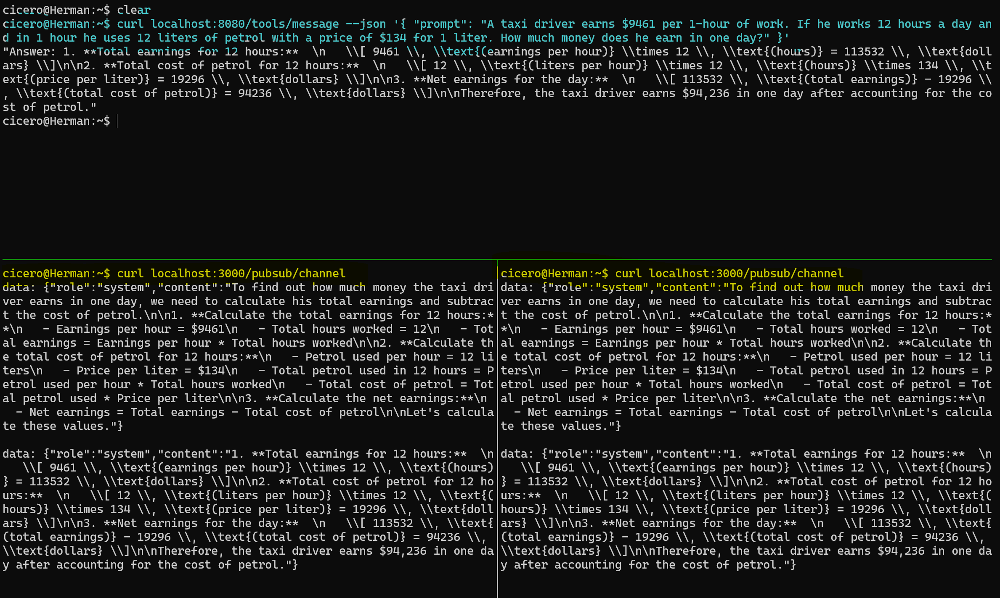

# Restate and Vercel AI SDK examples

A set of examples illustrating how to use [Restate](https://restate.dev/) ([Github](https://github.com/restatedev/)) to add durable execution, state, and communication to agents built with the [Vercel AI SDK](https://ai-sdk.dev)


## Setting up an Environment

### Starting Restate Server

For access to the latest nightly version, run Restate via Docker:

```shell
docker run --name restate_dev -it --rm --net=host \
  -e 'RESTATE_WORKER__INVOKER__INACTIVITY_TIMEOUT=5min' \
  -e 'RESTATE_WORKER__INVOKER__ABORT_TIMEOUT=15min' \
  -e 'RESTATE_ADMIN__experimental_feature_force_journal_retention=30d' \
  ghcr.io/restatedev/restate:main
```
*(Note, if '--net=host' is not available in your docker distribution, you need to expose ports 9070 and 8080, and be aware that services are not registered on 'localhost' but on 'host.docker.internal' instead.)*

Alternatively, download the server single binary and run it via `restate-server`, but this will miss some of the WIP UI features.


### Starting the Agents NextJS app

The project is a basic Next.js project, bootstrapped form the standard template.

```bash
npm run dev
```

The entry point is in the [restate/v1](app/restate/v1/[[...services]]/route.ts) route.

### Register the AI SDK agents at Restate

The simplest way to register new services is the UI, which is at [http://localhost:9070](http://localhost:9070).
See the screenshots below for a walkthrough.

If you have the [CLI installed](https://restate.dev/get-restate/),
you can also simply call `restate deployments register http://localhost:3000/restate/v1 --use-http1.1`

**Bear in mind that you need to replace *localhost* with *host.docker.internal*, if your docker distribution requires that**.


----
----

## An Example Walkthrough

Code: [multi_tool.ts](restate/services/multi_tool.ts)

This is inspired by this example: https://ai-sdk.dev/docs/foundations/agents#using-maxsteps 

The example is almost vanilla Vercel AI SDK code, with three small additions:

1. The AI agent function (`useToolsExample(...)`) is run as a Restate durable service handler.
   This gives the code durable retries and enables all further features.
   ```typescript
   export default restate.service({
     name: "tools",
     handlers: {
       message:
         // ...
         async (ctx: restate.Context, { prompt }) => {
           return await useToolsExample(ctx, prompt);
         }
     }
   });
   ```

2. We wrap the LLM model to make sure all inference steps are durable journalled:
   ```typescript
   const model = wrapLanguageModel({
     model: openai("gpt-4o-2024-08-06", { structuredOutputs: true }),
     middleware: durableCalls(ctx, { maxRetryAttempts: 3 }),
   });
   ```

3. We wrap tool calls into durable steps (`ctx.run(...)`)
   ```typescript
   execute: async ({ expression }) => {
          return await ctx.run(
            `evaluating ${expression}`,
            async () => mathjs.evaluate(expression),
            { serde: superJson }
          );
        },
   ```

### Invoking

Invoke it via http:
```shell
curl localhost:8080/tools/message --json '{ "prompt": "A taxi driver earns $9461 per 1-hour of work. If he works 12 hours a day and in 1 hour he uses 12 liters of petrol with a price of $134 for 1 liter. How much money does he earn in one day?" }'
```

Or use the UI playground in the UI on [localhost:9070](http://localhost:9070)


### Investigating the execution

Use the *Invocations* tab in the UI to see ongoing invocations. Adjust the filter below to also show finished (succeeded) invocations.

*NOTE: Retention of detailed timeline information is only available in the latest nightly build that can be run with the docker command above.*


## Other Examples

### Human approval

This example models a workflow that needs an approval.
It uses as tool with a durable promise for that.
The promise can be completed with a separate handler on the workflow.

Code: [human_approval.ts](./restate/services/human_approval.ts)

```typescript
// tool awaiting durable promise
riskAnalysis: tool({
  description: /* ... */
  parameters: z.object({ amount: z.number() }),
  execute: async ({ amount }) => {
    // send some how the request to the human evaluator.
    // A human evaluator will receive a notification with all the relevant details and on their own time (maybe days later)
    // respond with the decision.
    // ctx.run("notify a human", async () => sqs.sendMessage({ ... }))

    // and now we wait for the response
    return ctx.promise("approval");
  },
}),

// approval handler
approval: async (ctx: restate.WorkflowSharedContext, approval: string) => {
  ctx.promise("approval").resolve(approval);
}
```

The UI shows how the agentic workflow suspends when awaiting the durable promise.


The approval promise can be completed via the UI as well, select the *approval* handler. Make sure you address the right workflow (use the same key as you used for kicking off the workflow).


### Chat

This is an example of using virtual object state to remember the per-user chat history.
Virtual objects give us in addition guaranteed unique keys, guaranteed single writer concurrency, and state transactionality.

Code: [chat.ts](./restate/services/chat.ts)

```shell
# the object key is in the URL (malte / timer) and extracted to obtain locks,
# fetch state, and queue
curl localhost:8080/chat/malte/message --json '{ "message": "Hi, my name is Malte" }'
curl localhost:8080/chat/timer/message --json '{ "message": "Hi, my name is Timer" }'

curl localhost:8080/chat/malte/message --json '{ "message": "Who am I?" }' # => malte
curl localhost:8080/chat/timer/message --json '{ "message": "Who am I?" }' # => timer
```

You can explore the state of the Virtual Objects in the UI.


### Multi Agent

This example shows how to let one agent call another agent.
Code: [multi_agent.ts](./restate/services/multi_agent.ts)

We use Restate's durable RPC mechanism, which gives us reliable event-based RPC,
automatic idempotency, and suspends the calling agent while the callee agent is working. 

```typescript
riskAssessmentAgent: tool({
  // we make the other agent available as a tool here
  description:
    "A risk assessment agent that will determine the risk of a given loan request " +
    "It replies an object { risk } where risk is either 'high' or 'low'. " +
    "For example: { risk: 'high' } or { risk: 'low' }",
  parameters: LoanRequest,
  execute: async ({ amount, reason }) => {
    // call the risk assessment agent by making a durable call to the agent workflow
    const response = await ctx
      .workflowClient<RiskAssementAgent>({ name: "risk_assess" }, ctx.key)
      .run({ amount, reason });

    return response;
  },
})
```

When asking for a loan of 50000, the risk assessment agent will be called.

The UI shows how the calling agent is suspended, while the risk assessment agent is busy.


After the risk assessment agent completes, the callee resumes the workflow.


## Remote LLM Calls

This example demonstrates how to extract the LLM calls into a separate restate service.
Code: [remote_llm.ts](./restate/services/remote_llm.ts)

We use restate's durable RPC, virtual objects for concurrency control, and the flexibility of deployment to separate the long running 
I/O bound services (wait for the LLM to respond).
For example, clustering these calls in a Fluid compute runtime, or even a standalone VM/pod/ECS container. 

Use the `remoteCalls` middleware instead:

```typescript
const model = wrapLanguageModel({
     model: openai("gpt-4o-mini", { structuredOutputs: true }),
     middleware: remoteCalls(ctx, { maxRetryAttempts: 3, maxConcurrency: 10 }),
});
```

## Experiment - Persistent Result Event Stream

**Note:** This is an early experiment for now.

The [Multi Tool Agent Example](./restate/services/multi_agent.ts) publishes the intermediate
messages to a pubsub stream, which is implemented as a Restate Virtual Object (see [pubsub.ts](./restate/services/pubsub.ts)).

The pubsub stream is accessible via the [/pubsub/[topic]](app/pubsub/[topic]/route.ts) route.

The agent publishes messages via this hook:
```typescript
onStepFinish: async (step) => {
      publishMessage(ctx, "channel", {
        role: "system",
        content: step.text,
      });
    },
```

Below is a screenshot of a terminal with two concurrent stream subscribers receiving the intermediate step messages with the agent's reasoning.


